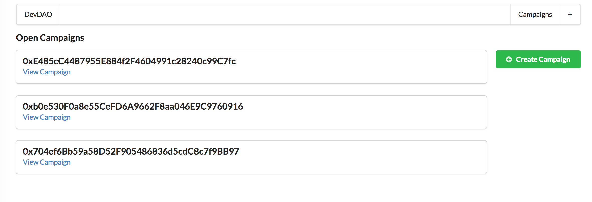
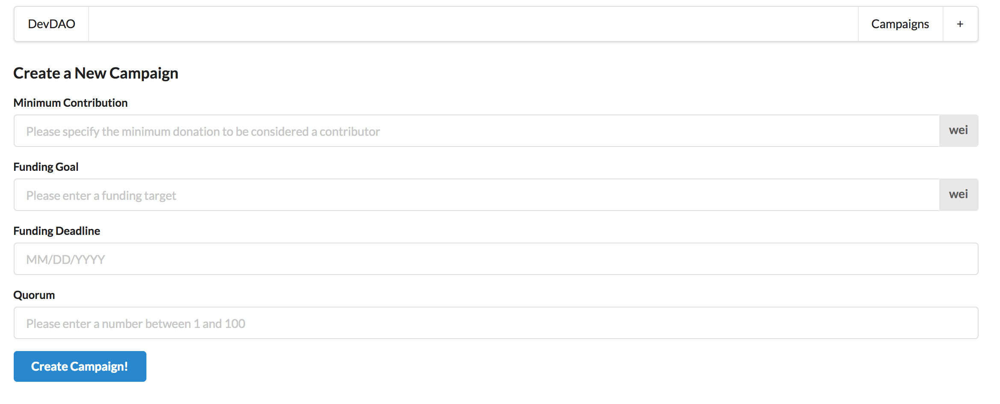
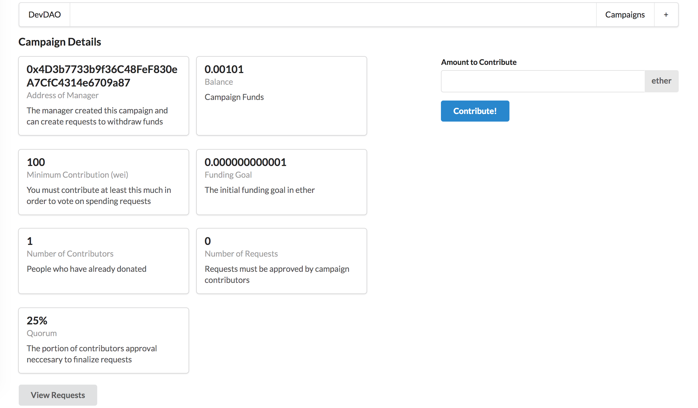

# kickstart-campaign-dApp
A Smart Contract for a basic kickstart campaign - Solidity/React dApp 

## To run the application: 
  ### Deploy Contracts and Create Application Instance 
  1. Clone the repository
  2. Make sure you have all the necessary node modules installed (see package.json file for list of dependencies)  
   a. To install modules open up the command line and type 
  
    npm install
    
  3. Compile and Deploy the Smart Contract  
   a. Navigate to the ./ethereum directory and run:
    
    node compile.js
   
   b. After compiling, deploy the smart contract using:
   
    node deploy.js
    
   If all goes well you should see the following in the CLI:  
  
    Attempting to deploy from:  <Ethereum External Account Address (ex: Metamask)>
    Contract deployed to:  <Contract Address>
  
  
  4. Create a local instance of the CampaignHQ smart contract  
    a. Add the contract address to the hq.js file within ./ethereum directory:
   
    const instance = new web3.eth.Contract(
      JSON.parse(CampaignHQ.interface),
      "<Contract Address>" // Address of deployed CampaignHQ
    );
  
  5. Create a application instance on http://localhost:3000/ with the command:
    
    npm run dev
      
  ### Create a Kickstart Campaign 
  Launch a kickstart campaign. Campaign owners create requests to spend the donations 
  they receive. Campaign contributors then vote on which requests they approve. 
  In order for the owner to spend funds, the request must reach a quorum of approval from the campaign contributors. 
 
  This provides additional assurance to campaign contributors that their donations will not be misallocated. 
  The smart contract allows the owner to spend funds ONLY when a specified portion of campaign contributors vote for 
  and approve of the spending request.  
  
  
  
  #### Create Campaign 
  1. Select either the `Create Campaign` or `+` button
  2. Specify the minimum contribution to the campaign 
    
  #### View Campaign Details 
  1. Navigate to the home page where your newly created campaign should be visible on the list of `Open Campaigns`
  2. Locate your campaign and select `View Campaign`
  
  
  
  Here you will be presented with a collection of information on the campaign including:
    
    • Address of the Owner
    • Balance
    • Minimum Contribution in Wei
    • Number of Contributors
    • Number of Requests
    
  From here you can contribute to the campaign or `View Reqeusts`
  
  #### Add New Requests (Campaign Managers only) 
  1. Select `View Requests`
  2. Select `Add Requests`
  3. Specify the amount to be spent, the recipient, and a short description for the request
  4. Select `Create Request`
  
  #### Approve Requests (Campaign Contributors only)
  #### Finalize Requests (Campaign Managers only)
  
  Note: This application makes use of Infura and the Ethereum Rinkeby Test Network. Anytime you make a transaction to the
  test network you will need to wait for transaction confirmation before the application will display the resulting
  state changes
  
  
  ### Unit test with Mocha  
    npm run test
    
  ## Important Note
  This project was completed with the guidance of Stephen Grider to gain familiarity and experience working with web3 and Solidity. 
  All credits and appreciation to him for his design, especially on the Ethereum side. In a world without many resources 
  in this area, his efforts are very much appreciated. Though several improvements were made, this project is for
  instructional and learning purposes ONLY and SHOULD NOT be used as stands for a production application. 
  
  Future Updates:
  Kickstart campaigns will specify an initial funding goal/deadline and proceed through an initial `Donation` phase 
  where users can donate funds. Upon reaching the funding goal, the campaign manager will unlock the ability to 
  create/finalize spending requests. Should the campaign not reach its funding goal by the deadline donations can 
  still continue, however, contributors will have the ability to withdraw their funds from the campaign. 
  
  The smart contract will be updated to make use of Open Zeppelin which (per their website) provides secure, tested and 
  community-audited code. In addition, an original and newly designed React/Redux Front-End application is in the works. 
  The hope is to complete it in the coming month. Finally, several bugs outlined in the Campaign.sol file need to be addressed
